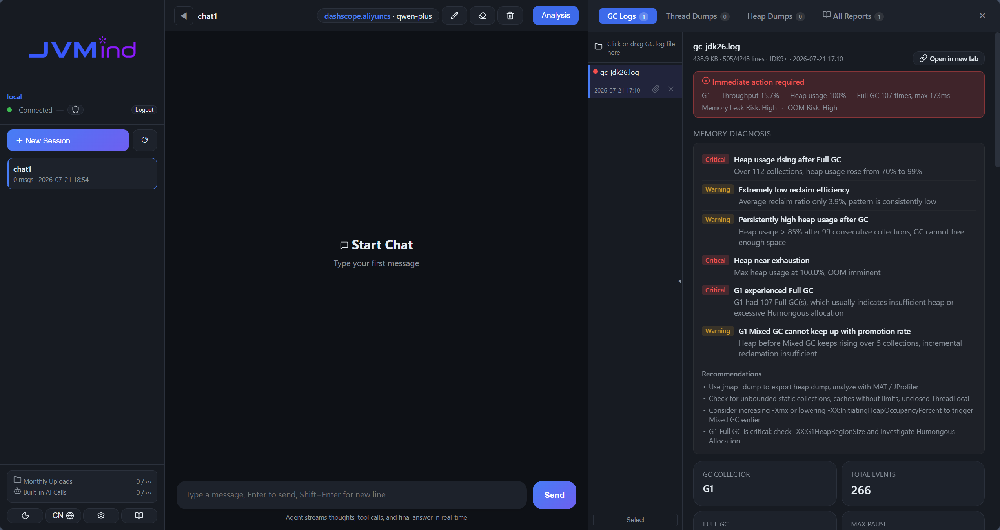

# JVMind 社区版

> 一个由 AI 驱动的 JVM 诊断智能体。**单用户 · 本地优先 · 开源。**
>
> An AI-powered JVM diagnostics agent. **Single-user · local-first · open source.**
>
> [English Documentation](./README.md) · [报告 Bug](https://github.com/jvmind/jvmind-ce/issues/new?template=bug.md) · [功能建议](https://github.com/jvmind/jvmind-ce/issues/new?template=feature.md)

JVMind CE 是基于 OpenAI 兼容大模型的 JVM 性能诊断助手，以本地 Web 服务形式运行，支持上传日志/转储，并通过 SSE 流式返回诊断结论。

- 🧠 **LangGraph Agent** — 通过 LangGraph 状态机编排工具（原生 OpenAI function-calling）
- 🪵 **GC 日志分析** — 支持 JDK 8 / 11 / 17 / 21 / 25 各代收集器（G1、Parallel、ZGC、Shenandoah、Serial、CMS），纯正则解析，零外部运行时依赖
- 🧵 **jstack 线程栈分析** — 死锁检测、锁竞争热点、线程池分布、火焰图、单线程钻取
- 💾 **Heapdump 分析（可选）** — 通过 Eclipse MAT 解析 GB 级 hprof 文件（需 JDK 21），自带 query-service 插件
- 🔌 **OpenAI 兼容 LLM** — DeepSeek、OpenAI、通义千问、Kimi、Ollama（本地）等，热重载 UI 配置
- 🏠 **Ollama 本地推理** — 完全离线运行，数据不离开本机，免 API Key，零成本

社区版**不含**计费、团队管理、配额限制等能力。如需这些功能请使用商业版。



---

## 快速开始

### 从 PyPI 安装

```bash
pip install jvmind-ce
jvmind
# 浏览器打开 http://127.0.0.1:8000
```

### 从源码安装（开发者模式）

```bash
git clone https://github.com/jvmind/jvmind-ce.git
cd jvmind-ce
python -m venv .venv && source .venv/bin/activate
pip install -e ".[dev]"
jvmind
```

### 配置 LLM

首次启动界面会引导填写 API Key。两种选择：

**方式 A — 远程 LLM 提供商（DeepSeek、OpenAI 等）：**

```bash
cp .env.example .env
# 编辑 .env：
OPENAI_API_KEY=sk-xxxxxxxxxxxxxxxx
OPENAI_BASE_URL=https://api.deepseek.com/v1
OPENAI_MODEL=deepseek-chat
```

**方式 B — 本地 Ollama（无需 API Key，零成本，完全离线）：**

```bash
# 1. 安装并启动 Ollama：https://ollama.com
# 2. 拉取模型：
ollama pull qwen2.5
# 3. 在 JVMind 界面设置（⚙️）中点击「Ollama · 本地」预设
#    或通过 .env 配置：
OPENAI_BASE_URL=http://localhost:11434/v1
OPENAI_MODEL=qwen2.5
#    留空 OPENAI_API_KEY——Ollama 不需要。
```

Agent 使用原生 OpenAI function-calling，任何支持 `tools` 参数的模型都可以。远程推理推荐 `deepseek-chat`，本地 Ollama 推荐 `qwen2.5` 或 `llama3.1`。

> **隐私说明**：使用 Ollama 本地模型时，所有数据（GC 日志、线程转储、堆转储、对话内容）都不会离开你的机器。

---

## 功能

### GC 日志分析

打开 **📊 GC 日志** 标签页，上传日志文件。流程：

1. 流式上传 → 存原始文本到 DB
2. 解析器（纯正则）抽取事件，计算统计，生成概览
3. 渲染：8 张状态卡 + 收集器分项表 + 堆变化曲线 + 停顿分布柱状图 + Top10 慢事件
4. 触发流式 LLM 诊断（按结构化模板：整体健康度 / 关键问题 / 参数调优 / 后续观察）

支持的收集器：**G1** · **Parallel** · **Serial** · **ZGC** · **Shenandoah** · **CMS**。JDK 9+ 统一日志与 JDK 8 PrintGCDetails 都支持。

### jstack 线程栈分析

打开 **🧵 线程栈** 标签页，上传 `jstack -l` 转储。功能：

- 线程状态直方图（RUNNABLE / BLOCKED / WAITING / TIMED_WAITING）
- 死锁检测与锁链可视化
- 锁竞争热点（持有者 + 等待者列表，点击钻取）
- 线程池分布、火焰图、单线程钻取
- 流式 LLM 诊断（整体 + 单线程）

### Heapdump 分析（可选，需 Eclipse MAT + JDK 21）

**🔍 堆转储** 标签页支持上传 GB 级 `.hprof`。架构：

```
  浏览器 ─▶ FastAPI（上传路由） ─▶ 本地盘: <dump_dir>/<report_id>/
                                              │
                                              ▼
                            worker_loop ─▶ ParseHeapDump.sh
                                              │
                                              ▼
                          ┌───── query-service（HTTP） ◀─────┐
                          │   自带于 vendor/mat/             │
                          └──────────────────────────────────┘
                                              │
                                              ▼
  浏览器 ◀────── SSE 进度 / JSON 查询结果 ◀───── FastAPI 代理
```

**一键安装 MAT 和 query-service：**

```bash
./scripts/install_mat.sh /opt/mat
# 或：MAT_HOME=/opt/mat ./scripts/install_mat.sh
```

脚本会下载 Eclipse MAT、解压，并把自带的 `com.jvmind.mat.query-0.1.0.jar` 复制到 MAT 的 plugins 目录。**注意：MAT 依赖 JDK 21。** 然后配置并启动：

```bash
# .env
MAT_HOME=/opt/mat
MAT_QUERY_SERVICE_URL=http://127.0.0.1:8090
```

```bash
# 终端 1：query-service
/opt/mat/MemoryAnalyzer -consoleLog -nosplash \
    -application com.jvmind.mat.query.QueryServiceApp

# 终端 2：heapdump worker（独立进程）
jvmind-worker
```

query-service jar 已包含在 `vendor/mat/`，用户无需自己编译 Java。

### Agent 内部结构

Agent 是 `react_agent/graph/` 中的 **LangGraph** 状态机：

- `facade.LangGraphAgent` — 公开 API，对齐旧版 agent 接口
- `graph_builder.build_graph` — 节点编排（Agent → Tools → Finalize）
- `nodes` — 工具执行 + 结构化推理（OOM 跨域诊断）
- `sse_adapter` — 产生 `user` / `token` / `step` / `fact_added` / `final` / `error` / `done` 事件
- `llm_compat` / `parsing_compat` — 共享 mixin，用于工具调用错误检测

默认走原生 OpenAI function-calling。若 provider 拒绝 `tools` 参数，agent 会清晰报错而不是悄悄降级。

---

## 配置

完整配置见 [`.env.example`](./.env.example)。关键变量：

| 变量 | 默认 | 用途 |
|------|------|------|
| `HOST` / `PORT` | `127.0.0.1` / `8000` | 监听地址 |
| `DATABASE_URL` | `sqlite:///./data/app.db` | SQLAlchemy 连接串，生产可切 PostgreSQL |
| `OPENAI_API_KEY` | — | 远程提供商必填；使用本地 Ollama 时留空 |
| `OPENAI_BASE_URL` | `https://api.deepseek.com/v1` | 任何 OpenAI 兼容端点 |
| `OPENAI_MODEL` | `deepseek-chat` | 模型名 |
| `OPENAI_TIMEOUT_SECONDS` | `60` | 单次 LLM 调用超时 |
| `CONFIG_ENCRYPTION_KEY` | — | 落盘 API Key 加密主密钥 |
| `HEAPDUMP_*` | 见 `.env.example` | 仅 heapdump 分析功能相关 |

界面也有 ⚙️ 配置弹窗用于 LLM 配置，修改后热重载 agent 并重新加密存储的 Key。

---

## 开发

```bash
# 开发服务器（自动重载）
uvicorn server:app --reload --port 8000

# 运行所有测试
python -m pytest _tests --no-cov

# 前端开发（Vite hot-reload）
cd frontend && npm install && npm run dev

# 前端生产构建
cd frontend && npm run build

# Heapdump worker（独立进程）
jvmind-worker
```

项目结构：

```
jvmind-ce/
├── server.py              # FastAPI 入口
├── app/                   # 路由、中间件、helpers
├── react_agent/
│   ├── graph/             # LangGraph agent（默认）
│   ├── gc_analyzer/       # GC 日志解析（多 JDK 适配）
│   ├── jstack_analyzer.py
│   ├── mat_tools.py       # Heapdump 工具封装
│   ├── heapdump_worker/   # MAT 后台解析
│   ├── memory_db.py
│   ├── user_manager_db.py # 单用户版
│   └── db.py / models.py
├── frontend/              # vanilla JS + Vite
├── vendor/mat/            # 自带 query-service jar
├── scripts/install_mat.sh # 一键安装 MAT
└── _tests/                # pytest 套件（146 个测试）
```

## 许可证

MIT — 见 [LICENSE](./LICENSE)。

## 贡献

参见 [CONTRIBUTING.md](./CONTRIBUTING.md) 与 [CONVENTIONS.md](./CONVENTIONS.md)。

## 致谢

JVMind CE 是从商业版 JVMind 中抽取而来。商业版包含多用户认证、团队协作、Paddle 计费、PostHog 分析等能力，本仓库刻意省略。